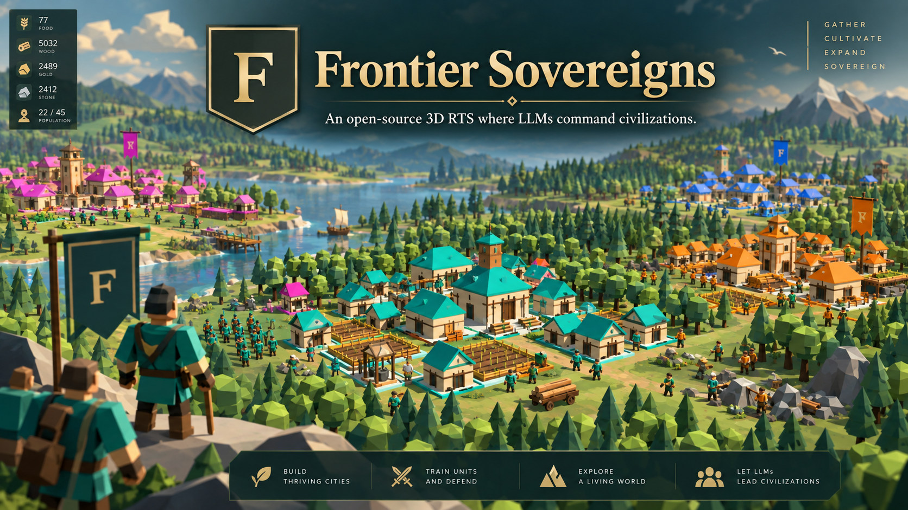
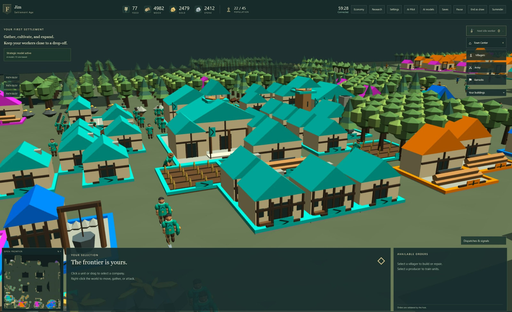
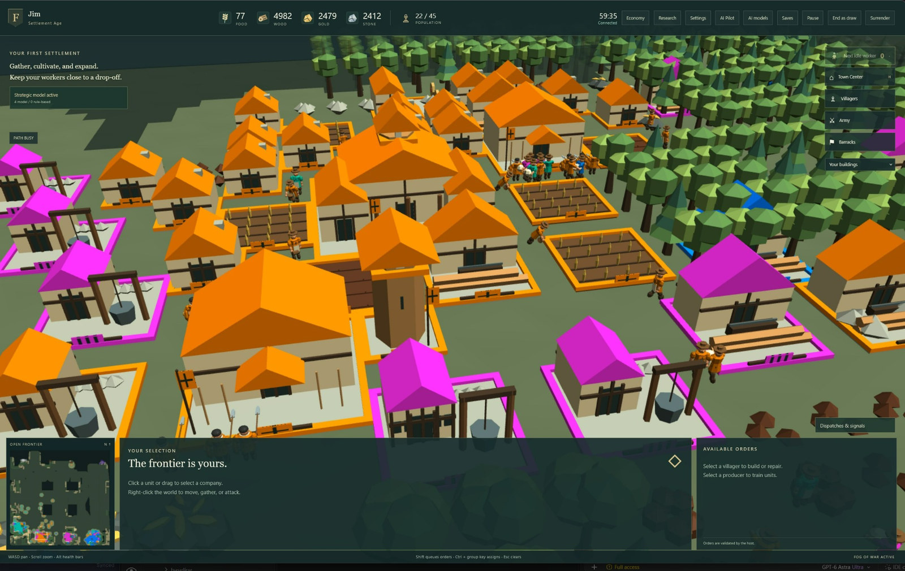
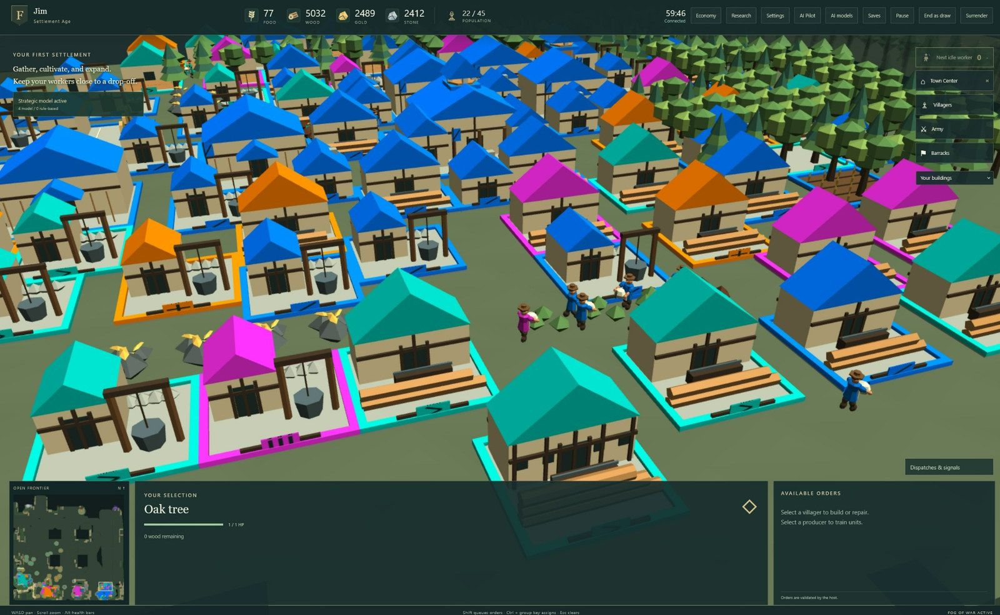
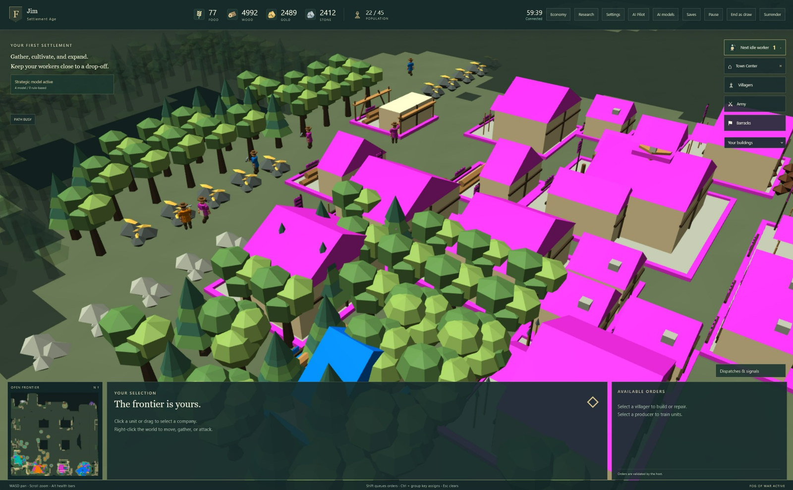

<!-- FRONTIER_SOVEREIGNS_VISUAL_INTRO_START -->
# Frontier Sovereigns

**Bring your own AI. Build your civilization.**

An open-source, browser-based 3D real-time strategy game with optional LLM strategic commanders.



<p align="center"><sub>AI-generated promotional artwork inspired by the game. Not a gameplay screenshot. Actual alpha gameplay is shown below.</sub></p>

<p align="center">
  <strong>Public alpha</strong> &nbsp;·&nbsp;
  <strong>Browser-based</strong> &nbsp;·&nbsp;
  <strong>Self-hosted</strong> &nbsp;·&nbsp;
  <strong>Bring Your Own AI</strong>
</p>

<p align="center">
  <a href="#fs-project"><strong>Get started</strong></a> &nbsp;·&nbsp;
  <a href="#fs-gameplay">Actual gameplay</a> &nbsp;·&nbsp;
  <a href="#fs-video">Gameplay video</a> &nbsp;·&nbsp;
  <a href="#fs-ai">Bring your own AI</a> &nbsp;·&nbsp;
  <a href="https://github.com/frontier-sovereigns/frontier-sovereigns/releases">Releases</a> &nbsp;·&nbsp;
  <a href="https://github.com/frontier-sovereigns/frontier-sovereigns/issues">Report an issue</a>
</p>

Frontier Sovereigns brings model-driven strategy into a playable RTS: gather resources, develop a settlement, and play alongside or against AI commanders. Host a match, connect a compatible model, and see how its decisions unfold in the game.

> [!NOTE]
> **v0.1.0-alpha.1 is the first public alpha release.** Large-match performance, sustained multiplayer/model throughput and complete eight-age playthroughs still need broader validation. Configurable player limits do not establish performance on every computer. See [performance](docs/PERFORMANCE.md). Reproducible bug reports and playtesting feedback are welcome.

<a name="fs-gameplay"></a>

## Actual gameplay

Screenshots from the alpha, with the in-game interface visible. Select an image to view it at a larger size.

<table>
  <tr>
    <td width="50%" valign="top">
      <a href="docs/media/readme/settlement-teal.jpg">
        
      </a>
      <br><strong>A settlement up close</strong>
      <br>Villagers, farms, and teal-roofed buildings.
    </td>
    <td width="50%" valign="top">
      <a href="docs/media/readme/settlement-orange.jpg">
        
      </a>
      <br><strong>Buildings, farms, and units</strong>
      <br>A closer look at an orange settlement.
    </td>
  </tr>
  <tr>
    <td width="50%" valign="top">
      <a href="docs/media/readme/settlement-multifaction.jpg">
        
      </a>
      <br><strong>A colorful shared world</strong>
      <br>Several faction colors in the same scene.
    </td>
    <td width="50%" valign="top">
      <a href="docs/media/readme/settlement-forest.jpg">
        
      </a>
      <br><strong>At the forest edge</strong>
      <br>A settlement surrounded by trees and resources.
    </td>
  </tr>
</table>

<a name="fs-video"></a>

## Gameplay video

[Open or download the gameplay recording (MP4, 1:12, 81.9 MiB)](docs/media/readme/frontier-sovereigns.mp4)

Actual alpha gameplay showing an early settlement, villagers gathering resources and building construction, with the in-game interface visible.

<a name="fs-ai"></a>

## Bring your own AI

**Models make strategic plans. The game handles real-time execution.** Tactical movement, gathering and combat continue while a model is busy or unavailable. Models receive only their faction's authorized knowledge.

| Play your way | What to explore |
| --- | --- |
| **Take command** | Build a settlement and play against AI commanders. |
| **Try AI Pilot** | Let a model help control your civilization while your manual orders take priority. |
| **Bring a compatible model** | The host connects a local or API-hosted OpenAI-compatible endpoint. |
| **Host a match** | Bring friends into the same game through their browsers. |

The host configures model endpoints; players choose from the enabled catalog. Model credentials stay on the server. A loopback address such as `127.0.0.1` points to the game host. Models are optional: rule-based commanders can play without one.

See [model integration](docs/MODEL_INTEGRATION.md) for compatible interfaces, configuration and limitations, [self-hosting](docs/SELF_HOSTING.md) for network and security guidance, and [contributing](CONTRIBUTING.md) to help improve the game.

---

<!-- FRONTIER_SOVEREIGNS_VISUAL_INTRO_END -->

<a name="fs-project"></a>

## Quick start

Only the person hosting needs to install and run the server. Other players can [join from a browser](#fs-join). The host can also play in a browser on the same computer.

This is a source-code setup: the build step creates the playable game. Use **Node.js 22.23.2**, Corepack and the pinned **pnpm 10.30.3**. You need an internet connection for the initial dependency download and a desktop WebGL2 browser, keyboard and mouse for play. Chrome is used by the default browser test suite.

Choose [Windows setup](#fs-windows) or [macOS setup](#fs-macos), then [build and start](#fs-build).

<a name="fs-windows"></a>

### Windows setup

1. Install Node.js **22.23.2** from the [official release downloads](https://nodejs.org/download/release/v22.23.2/). Choose the Windows `.msi` for your computer: `x64` for most PCs, or `arm64` for Windows on ARM. Keep Corepack and the PATH option enabled in the installer, then reopen your terminal.
2. On [this repository's GitHub page](https://github.com/frontier-sovereigns/frontier-sovereigns), select **Code → Download ZIP**. Right-click the downloaded ZIP and choose **Extract All**. You can use an existing Git clone instead.
3. In File Explorer, open the extracted folder containing `package.json`. Click the address bar, type `powershell`, and press Enter to open PowerShell in that folder.
4. Check the tools, then continue to **Build and start** below:

```powershell
node --version
corepack pnpm --version
```

Expect `v22.23.2` and `10.30.3`. The first Corepack command may ask to download pnpm. If PowerShell blocks a `.ps1` shim, use `corepack.cmd pnpm` in place of `corepack pnpm` in the commands below; no execution-policy change is needed.

<a name="fs-macos"></a>

### macOS setup

1. Install Node.js **22.23.2** using the macOS `.pkg` from the [official release downloads](https://nodejs.org/download/release/v22.23.2/), then reopen Terminal. If you use a Node version manager, select the version in `.node-version` instead.
2. On [this repository's GitHub page](https://github.com/frontier-sovereigns/frontier-sovereigns), select **Code → Download ZIP**. Open the ZIP in Finder to extract it. You can use an existing Git clone instead.
3. Open **Terminal** from Applications → Utilities. Type `cd` followed by a space, drag the extracted folder containing `package.json` from Finder into Terminal, and press Return.
4. Check the tools, then continue to **Build and start** below:

```sh
node --version
corepack pnpm --version
```

Expect `v22.23.2` and `10.30.3`. The first Corepack command may ask to download pnpm. These steps use the same source workflow as Windows; macOS hosting and gameplay have not yet been verified for this release.

<a name="fs-build"></a>

### Build and start

Run these commands one at a time from the folder containing `package.json`, in PowerShell or Terminal. Wait for each to finish successfully before running the next:

```sh
corepack pnpm install --frozen-lockfile
corepack pnpm build
corepack pnpm start
```

The first build generates the 3D assets and may take a few minutes. `start` keeps running: leave that terminal open while playing.

### Play your first match

Open **http://127.0.0.1:3000** on the server computer. Enter the one-use token from the interactive server console in **Host access**. Background starts keep it in the private `runtime-data/host-bootstrap.txt` file instead. The token expires after ten minutes. Host access appears only at the local host address; other players use an invitation code.

Join the host-player slot, choose **Guided quiet practice** or configure a match, mark ready and start. A model endpoint is optional. Save before stopping the server with Ctrl+C.

- Click a villager to select it, then right-click a resource to gather. Right-click open ground to move.
- Use WASD or the arrow keys to pan, the mouse wheel to zoom, and `.` to select the next idle villager.
- Scroll inside the building menu to reach more buildings. See [gameplay and controls](docs/GAMEPLAY.md) for construction, combat and camera rotation.

A mouse with right and middle buttons is easiest on either platform. On a Mac trackpad, enable secondary click and use a two-finger click for right-click orders. Control-key game shortcuts use **Control**, not Command.

To play again, open a terminal in the same folder and run `corepack pnpm start`. You do not need to install or build again unless the code or dependencies changed. Closing the browser does not stop the server; save the match and use Ctrl+C in its terminal.

### Host a game on your home network

After building, stop your current server with Ctrl+C. Start it for LAN play using the commands for your platform. These settings apply to this launch; for persistent `.env` settings, see [self-hosting](docs/SELF_HOSTING.md).

**Windows / PowerShell:**

```powershell
$env:NODE_ENV = 'production'
$env:GAME_BIND = '0.0.0.0'
$env:GAME_LAN_MODE = 'true'
corepack pnpm start
```

The PowerShell settings remain for later starts in that terminal; close it to clear them.

**macOS / Terminal:**

```sh
NODE_ENV=production GAME_BIND=0.0.0.0 GAME_LAN_MODE=true corepack pnpm start
```

Keep using **http://127.0.0.1:3000** for host controls. Give friends the **LAN address printed by the server** and the lobby's invitation code. Allow the game port through your firewall for your private/home network if needed. These steps are for the same network; internet hosting requires the additional proxy/security setup in [self-hosting](docs/SELF_HOSTING.md). Never share the host access token or expose the model service to players.

<a name="fs-join"></a>

### Join an existing game — Windows or Mac

Players only need a desktop WebGL2 browser, keyboard and mouse. They do not need Node.js, this repository or a model endpoint. Open the address supplied by the host, enter your name and invitation code, join and mark ready. Use the host's LAN address when playing from another computer: `127.0.0.1` would point to your own computer. See [multiplayer](docs/MULTIPLAYER.md) for reconnection and restored saves.

### Setup troubleshooting

| Problem | What to do |
| --- | --- |
| `node` or `corepack` is not found | Reopen the terminal after installing Node 22.23.2 with Corepack. If your Node distribution omits Corepack, follow its [installation instructions](https://github.com/nodejs/corepack#installation). |
| `package.json` is missing | Change to the extracted repository folder containing that file, not the ZIP or its parent folder. |
| Port 3000 is already in use | Stop your own previous game terminal with Ctrl+C; run one host per port. |
| Host access is missing or the token expired | Use the local address on the host computer. For an expired token, save/stop your host, restart it and use the newly issued token. |
| Another computer cannot join | Use LAN startup above, check both devices are on the same network, and check the host's private-network firewall. |

More help: [getting started](docs/GETTING_STARTED.md), [self-hosting and save compatibility](docs/SELF_HOSTING.md), and [model configuration](docs/MODEL_INTEGRATION.md).

For development, run `corepack pnpm dev` after installation and the first build; open **http://127.0.0.1:5173**.

## Current game

Frontier Sovereigns is a browser-based 3D real-time strategy game with a headless authoritative server and optional AI/LLM strategic commanders. Each browser renders its own Babylon.js world; the host runs the simulation and connects to model endpoints.

- Gather food, wood, gold and stone; construct settlements, train armies, research technologies and fight through eight continuous ages.
- Play Open Frontier or River Divide with teams or free-for-all, fog of war, walls, gates, siege and optional Monument victory.
- Configure five remote humans, an optional host-player and up to five AI factions: eleven factions in total.
- Assign host-managed models to commanders, or enable **AI Pilot** for a human faction while keeping manual orders in control.
- Use rule-based AI without an endpoint, guided quiet practice, saves, reconnection and viewpoint recordings.
- Build procedural 3D assets, animations, icons and audio from included generators.

## Documentation

| Guide | Contents |
| --- | --- |
| [Getting started](docs/GETTING_STARTED.md) | Installation and first match |
| [Gameplay](docs/GAMEPLAY.md) | Controls, economy, ages, combat and AI Pilot |
| [Self-hosting](docs/SELF_HOSTING.md) | Configuration, LAN, proxy and recovery |
| [Multiplayer](docs/MULTIPLAYER.md) | Joining, teams, disconnects and restored slots |
| [Model integration](docs/MODEL_INTEGRATION.md) | Endpoint catalog, configuration and troubleshooting |
| [AI commander API](docs/AI_COMMANDER_API.md) | Observations, plans, validation and adapters |
| [Architecture](docs/ARCHITECTURE.md) | Source layout and state flow |
| [Protocol](docs/PROTOCOL.md) | Sessions, commands and filtered views |
| [Modding](docs/MODDING.md) | Content, mechanics and assets |
| [Testing](docs/TESTING.md) | Build, unit, browser, model and packaging checks |
| [Performance](docs/PERFORMANCE.md) | Worker settings and load profiles |

## Development

```sh
corepack pnpm typecheck
corepack pnpm test
corepack pnpm build
corepack pnpm test:e2e
```

The browser suite requires installed Chrome by default; see [testing](docs/TESTING.md) for alternatives. Read [CONTRIBUTING.md](CONTRIBUTING.md) and [SECURITY.md](SECURITY.md).

## License

Source code, including asset generators, is licensed under [Apache-2.0](LICENSE). Original generated 3D assets, icons and audio are licensed under CC BY 4.0 with attribution to Jim Liu; see [asset licensing](assets/LICENSE.md). See also [NOTICE](NOTICE) and [third-party notices](THIRD_PARTY_NOTICES.md).

Documentation artwork and screenshot provenance are recorded in the [media inventory](docs/media/README.md); no additional media license is granted by this README update.
